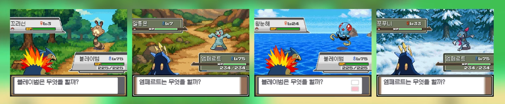

# HG-patches

A collection of patches for **Pokémon HeartGold (English)** ported from other ROM hacks and regional versions.

---

## 📦 Patches

#### - [Battle Backgrounds](BattleBackgroundsByMintChok(en).xdelta) — by MintChok, English Port

Replaces the default battle backgrounds in the English version of Pokémon HeartGold with custom pixel art battle backgrounds.

This is a direct port of the battle background mod originally created by **Mint Chok** for the Korean version of HeartGold. All credit for the artwork and original implementation goes to them. I only adapted the patch to work with the English ROM.



Total of 18 differents battle backgrounds, including time variations.

#### - Coming soon...

## How to Apply

You will need:
- An **xdelta patcher** (e.g. [xdeltaUI](https://www.romhacking.net/utilities/704/) on Windows, or `xdelta3` on Linux/macOS)
- A clean, unmodified English HeartGold ROM
- The `.xdelta` patch file from this repository

**Steps:**

1. Open your xdelta patcher.
2. Select the `.xdelta` patch file as the **Patch**.
3. Select your clean HeartGold ROM as the **Source file**.
4. Choose an output path for the **Output file**.
5. Apply the patch.

**Linux / macOS (CLI):**
```bash
xdelta3 -d -s original.nds battleBG_patch.xdelta output.nds
```

## 📄 Disclaimer

This repository contains only patch files (`.xdelta`). No ROM files are included or distributed. You must supply your own legally obtained copy of Pokémon HeartGold.
